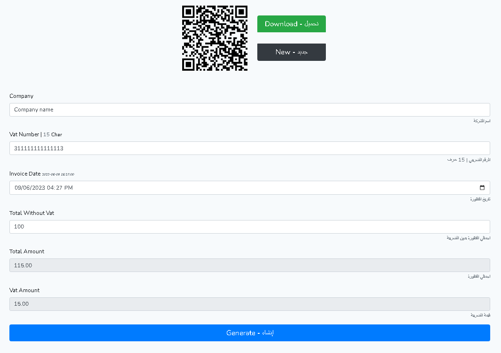

## ZATCA Qr Creator by mPhpMaster



```shell
git clone https://github.com/hlaCk/zatca-qr-creator.git zatca-qr-creator
cd zatca-qr-creator
cp .env.example .env
copy .env.example .env
composer install
php artisan key:generate
start http://127.0.0.1:8000 &
php artisan serve
```

[http://localhost:8000/](http://localhost:8000)
